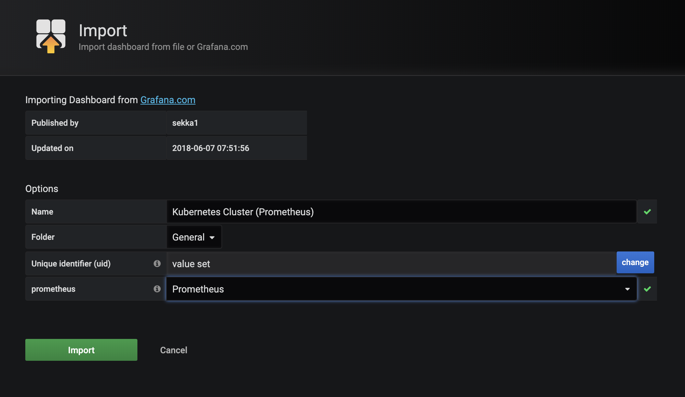

WIP - Bootstrap Infrastructure
===

This repo contains a reference infrastructure setup that you can change to your own liking.

The idea being, whether you are developing an application/set of services/operators you'd want a consistent environment

# Motivation

Local and Proper/Production setup

# Requirements

## Common Requirements
* `helm` - https://helm.sh/docs/using_helm/#installing-helm
* `kubectl` - https://kubernetes.io/docs/tasks/tools/install-kubectl/

## Local Deployment Requirements

* `minikube` - https://kubernetes.io/docs/setup/learning-environment/minikube/
  * optional/recommended - `hyperkit` -> https://github.com/moby/hyperkit

## Production Deployment Requirements
* `terraform` - https://www.terraform.io/
* `aws-iam-authenticator`  - https://docs.aws.amazon.com/eks/latest/userguide/install-aws-iam-authenticator.html

# Quick Start

## Minikube setup (OSX)

Make sure you are not using a VPN. It may interfere with Minikube.

Start `minikube`, configure it with your vm-driver of choice and resources. Keep in mind that a big elasticsearch cluster might require more than the default amount of `--memory`.

All the commands are assuming your current working directory is the root of this repository.


```bash
$ minikube start --vm-driver hyperkit --memory 8192 --cpus 4
```

### Helm Initialization
```bash
$ kubectl create serviceaccount tiller --namespace kube-system
$ kubectl create clusterrolebinding tiller-role-binding --clusterrole cluster-admin --serviceaccount=kube-system:tiller
$ helm init --service-account tiller
```

### Installing Prometheus and Graphana
Install prometheus operator:
```
kubectl create namespace prometheus
helm install stable/prometheus \
     --name prometheus \
     --namespace prometheus \
     --set alertmanager.persistentVolume.storageClass="standard" \
     --set server.persistentVolume.storageClass="standard"
```

And grafana (take note of the password):
```
kubectl create namespace grafana
helm install stable/grafana \
     --name grafana \
     --namespace grafana \
     --set persistence.storageClassName="standard" \
     --set adminPassword="bootstrapadmin" \
     --set datasources."datasources\.yaml".apiVersion=1 \
     --set datasources."datasources\.yaml".datasources[0].name=Prometheus \
     --set datasources."datasources\.yaml".datasources[0].type=prometheus \
     --set datasources."datasources\.yaml".datasources[0].url=http://prometheus-server.prometheus.svc.cluster.local \
     --set datasources."datasources\.yaml".datasources[0].access=proxy \
     --set datasources."datasources\.yaml".datasources[0].isDefault=true \
     --set service.type=LoadBalancer
```

After installing the chart, you can grab the pod name:

```
kubectl get pods -n grafana
.
.
.
NAME                      READY   STATUS    RESTARTS   AGE
grafana-9995876cc-j2kdz   1/1     Running   1          1m

```

Access it via port-forwarding `3000`, which in the above case is `grafana-9995876cc`:
```
kubectl port-forward -n grafana POD_NAME 3000 
```

You can import a custom dashboard that will display basic cluster health: https://grafana.com/dashboards/6417

To do so navigate to http://localhost:3000, on the hover menu import a dashboard:


Fill in the `ID` and the datasource:





### Elasticsearch 

More info:  [env/elastic](env/elastic/README.md)

First we will install the `elasticsearch-operator`:
```
helm install --name es-operator \
     --namespace kube-system \
     ./charts/elasticsearch-operator
```

After that you should see, that the [CustomResourceDefinition](https://kubernetes.io/docs/concepts/extend-kubernetes/api-extension/custom-resources/#customresourcedefinitions) has been created:
```
➜  bootstrap-infra git:(master) ✗ kubectl get CustomResourceDefinitions
NAME                                         CREATED AT
elasticsearchclusters.enterprises.upmc.com   2019-06-22T11:44:46Z
➜  bootstrap-infra git:(master) ✗ kubectl get elasticsearchclusters
No resources found.
➜  bootstrap-infra git:(master) ✗ kubectl get foo
error: the server doesn't have a resource type "foo"
```

After that, we will be launching the `EFK` stack:
```
helm install --name efk \
    --namespace logging \
    ./charts/efk \
    -f ./env/elastic/values.minikube.yaml
```

And you should see:
```
➜  bootstrap-infra git:(master) ✗ k get pods -n logging
NAME                                     READY   STATUS              RESTARTS   AGE
efk-kibana-d7b549b5c-n7b82               0/1     ContainerCreating   0          33s
es-client-efk-cluster-664f8fcb94-r2qb8   0/1     ContainerCreating   0          33s
es-data-efk-cluster-default-0            0/1     ContainerCreating   0          32s
es-master-efk-cluster-default-0          0/1     ContainerCreating   0          33s
fluent-bit-wlv62                         1/1     Running             0          33s
```

This also deploys an elasticsearch-curator which purges the indices every 7 days. This is configurable in `values.yaml`. 

You can access the deployed kibana by grabbing the name and port-forwarding like in the case of grafana like so:
```
kubectl port-forward efk-kibana-d7b549b5c-n7b82 5601 -n logging 
```

After that, you will be asked to create an index pattern and select a time filter. You can use `kube*` to match across all indices (which come in as `kubernetes_cluster-YYYY.MM.DD`) and `@timestamp` for the filter:


### Cleaning Up

To stop the `minikube` cluster:
```
minikube stop
```

And to clean it up and delete the artifacts:
```
minikube delete
```

## Production Setup (AWS EKS Example)

Setup the cluster using the provided terraform configs from the major cloud providers (or add your own). All the outputs from the terraform configs include the guide on how to setup `kubectl` for the deployed cluster.

### Terraform
From 

### Helm Initialization
```bash
$ kubectl create serviceaccount tiller --namespace kube-system
$ kubectl create clusterrolebinding tiller-role-binding --clusterrole cluster-admin --serviceaccount=kube-system:tiller
$ helm init --service-account tiller
```

### Installing Prometheus and Graphana
Install prometheus operator:
```
kubectl create namespace prometheus
helm install stable/prometheus \
     --name prometheus \
     --namespace prometheus \
     --set alertmanager.persistentVolume.storageClass="gp2" \
     --set server.persistentVolume.storageClass="gp2"
```

And grafana (take note of the password):
```
kubectl create namespace grafana
helm install stable/grafana \
     --name grafana \
     --namespace grafana \
     --set persistence.storageClassName="gp2" \
     --set adminPassword="bootstrapadmin" \
     --set datasources."datasources\.yaml".apiVersion=1 \
     --set datasources."datasources\.yaml".datasources[0].name=Prometheus \
     --set datasources."datasources\.yaml".datasources[0].type=prometheus \
     --set datasources."datasources\.yaml".datasources[0].url=http://prometheus-server.prometheus.svc.cluster.local \
     --set datasources."datasources\.yaml".datasources[0].access=proxy \
     --set datasources."datasources\.yaml".datasources[0].isDefault=true \
     --set service.type=LoadBalancer
```
### Elasticsearch 

More info:  [env/elastic](env/elastic/README.md)

Before installing deployments with passed in `values.yaml` inspect them individually, for examples when setting up zones for ES cluster:
```
zones: ["us-east-1a", "us-east-1b", "us-east-1c"]
```

First we will install the `elasticsearch-operator`:
```
helm install --name es-operator \
     --namespace kube-system \
     ./charts/elasticsearch-operator
```

After that, we will be launching the `EFK` stack:
```
helm install --name efk \
    --namespace logging \
    ./charts/efk \
    -f ./env/elastic/values.yaml
```

This also deploys an elasticsearch-curator which purges the indices every 7 days. This is configurable in `values.yaml`. 

Kibana is accessible via port-forward.


# Folder Structure

The folder structure is grouped as follows:

* `/charts` - contains packaged charts (i.e. those not provided by the official `stable` repository), chart scripts, and related information
  * `/charts/observability` - aggregated logging, metrics, elasticsearch etc.
  * `/charts/controller` - Prometheus, Let's Encrypter issuers
* `/tf` - terraform config charts for deploying
  * `AWS EKS`
  * `GCP GKE`
  * `DO Kubernetes Engine`
  * `tectonic`
* `/env` - infrastructure environment, contains the 
  * `/env/monitoring` - grafana, kibana
  * `/env/elasticsearch` - elasticsearch cluster


# TODOs

- [ ] Create some basic setup scripts and/or CLI tools to automate all of the bootstrapping phase (especially locally)
- [ ] Describe pushing docker / images workflow with local deployment
